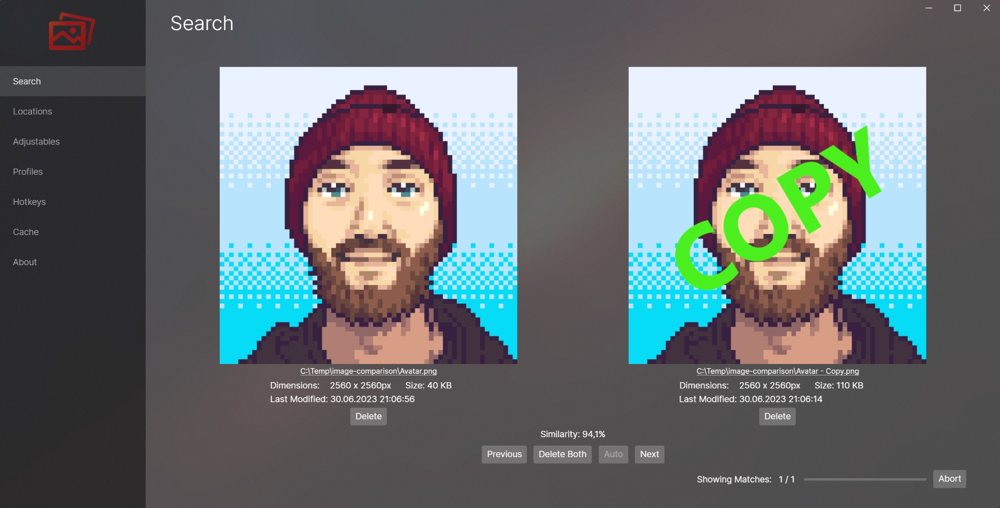

# Image Comparison

## About

App for comparing large numbers of images within or between directories for duplicates and similarities. Does not rely on resolution or exact pixel by pixel matches to detect similar images.

## Usage

Just extract your downloaded version of the App and execute `ImageComparisonGUI.exe`. No Installation required.

There is also a command line tool `ImageComparison.exe`. For arguments and correct usage, execute with `--help` parameter.

If you plan on developing, Visual Studio should do much of the work, besides clicking on Start.

I developed this app for windows specific. Feel free to contribute changes that makes it compatible for other OS' as well. Since I used Avalonia for the UI, there should not be that much to adjust like some calls to the file explorer.

## Features

- Image similarity detection (obviously) based on edge detection rather than pixel by pixel
- Preview and details of the images of the recognized matches
- In app deletion of images (permanent, to recycle bin or folder on your pc)
- Image Analysis Cache, so only new images have to be processed
- No-Match Cache, for repeated comparison of the same folders
- Different Search modes between directories (all, inclusive, exclusive, list inclusive, list exclusive)
- Different Hash modes (Perceptual and Difference Hash)
- Adjustables for granularity/detail of the image analysation
- Auto Processor for automatic image deletion according to adjustable ruleset
- Search Profiles
- Hotkeys
- Command line tool

## State

The currently supported features work as intended and in my tests reliable. Make sure that you try out different settings for the adjustable image analyser yourself to find the sweetspot for your image sets before automatically deleting any pictures. I do not take responsibility for wrong detected matches.

If you have any ideas, problems or solutions, feel free to open an issue or contributing to the project.

## How does it work?

You can find a detailed explanation of the algorithm(s) used in this project down in the credits.

tl;dr:
The app searches for edges (Discrete Hash) or low frequencies of Discrete Cosine Transformations similar to Fourier Transformations (Perceptual Hash) in a downscaled version of the image (resolution adjustable with the detail slider) and saves this information in a hash value. By comparing these hash values against all other images hash values we can detect how far off the images are. Since the generation of these hash values takes the vast majority of processing power / time, we can cache this information and compare already analysed folders pretty quick.

## Credit

Underlying algorithms for image analysis developed by David Oftedal and Dr. Neal Krawetz:
[http://01101001.net/differencehash.php](http://01101001.net/differencehash.php)
[https://www.hackerfactor.com/blog/index.php?/archives/432-Looks-Like-It.html](https://www.hackerfactor.com/blog/index.php?/archives/432-Looks-Like-It.html)
[https://www.hackerfactor.com/blog/index.php?/archives/529-Kind-of-Like-That.html](https://www.hackerfactor.com/blog/index.php?/archives/529-Kind-of-Like-That.html)

Template for the implemented Hash functions, that I customized for adjustable hash size in this project:
[https://github.com/coenm/ImageHash/](https://github.com/coenm/ImageHash/)

Although I did not have any Code from this app I developed it as replacement for [Similar Images](https://tn123.org/simimages/) by Nils Maier, because I had trouble on recognizing some image similarities and attaching network storage, that the app refused to load images from at all.